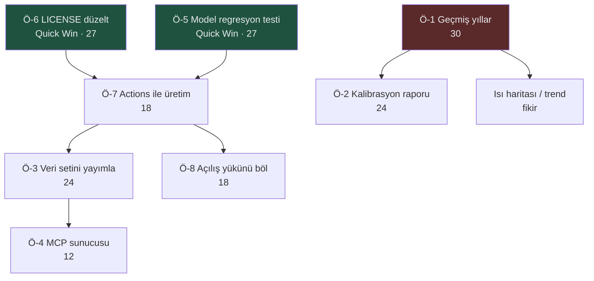

# 🔭 osym — Geliştirme Tarama Raporu

**Tarih**: 2026-08-19 · **Proje Tipi**: Statik veri sitesi + Python veri hattı (bağımlılıksız) · **Sınıf**: Küçük · **Odak**: `github`

---

## 0. Uygulama Durumu (19.08.2026 — aynı gün uygulandı)

| Durum | Öneriler |
|---|---|
| ✅ Yapıldı (8) | Ö-3 CSV + veri sözlüğü · Ö-4 MCP sunucusu · Ö-5 regresyon testleri · Ö-6 MIT lisansı · Ö-7 CI · Ö-8 açılış yükü bölündü · Ö-9 README rozet/İngilizce · Ö-10 kaynak bütünlüğü |
| 🟡 Kısmi (2) | **Ö-1** altyapı hazır (`build_data.py` yıl parametreli), ama **kaynak veri engelli**: ÖSYM 2024/2025 sayısal bilgiler sayfalarını sitesinden kaldırmış, Wayback arşivinde de yok. **Ö-2** `kalibrasyon.py` yazıldı ve çalışıyor, ama YÖK Atlas 2026 verisi henüz yayımlanmadı. |

**Ölçülen kazanım:** açılış yükü 1,54 MB → ~50 KB (gzip'li `ozet.json`); tam veri yalnız program
listesi gereken sekmelerde iniyor. GitHub lisansı artık MIT olarak tanınıyor. Model değişmezleri
CI'da her push'ta doğrulanıyor.

## 1. Proje Bugün Ne Durumda

ÖSYM'nin 18.08.2026'da yayımladığı resmî TABLO-3/TABLO-4 dosyalarını 21.493 programlık tek bir veri
setine çeviriyor ve ÖSYM'nin **yayımlamadığı** başarı sırasını, yine ÖSYM'nin kendi puan dağılımı
tablosundan probit interpolasyonla tahmin ediyor. Çıktı, framework'süz tek bir `index.html` ile
GitHub Pages ve Vercel'de yayında. Güçlü yanları: veri doğruluğu ÖSYM'nin resmî toplamıyla birebir
tutuyor (730.854 yerleşen), sıralama modeli yedi bağımsız barajla %0,1–1,5 sapmayla doğrulanmış,
tüm hesap açık kaynak ve tek komutla yeniden üretilebiliyor.

Bugünkü sınırı tek cümleyle: **tek yıllık bir fotoğraf** ve **yalnız insan gözüyle tüketilebilir** —
geçmiş yıl karşılaştırması ve programatik erişim yok.

---

## 2. 🌍 Dış Dünya: Benzer Projeler ve Pazar

### Benzer GitHub Projeleri

| Proje | ⭐ | Son commit | Öne çıkan özellikleri |
|---|---|---|---|
| [saidsurucu/yokatlas-mcp](https://github.com/saidsurucu/yokatlas-mcp) | 71 | 2026-07-23 | YÖK Atlas için MCP sunucusu; barındırılan uzak MCP; fuzzy arama; 4 yıllık istatistik |
| [saidsurucu/yokatlas-py](https://github.com/saidsurucu/yokatlas-py) | 59 | 2026-07-23 | PyPI paketi, sync+async istemci, Pydantic v2 modelleri, "net sihirbazı", 4 yıllık geçmiş |
| [MorphaxTheDeveloper/yokatlas-dataset-2025](https://github.com/MorphaxTheDeveloper/yokatlas-dataset-2025) | 9 | 2025-12-31 | 2015–2024 program bazlı CSV; tercih istatistikleri, cinsiyet, ek kontenjan. **Lisans yok** |
| [izcir/YokAPI](https://github.com/izcir/YokAPI) | 7 | 2026-07-01 | PyPI paketi — **Haziran 2026'dan beri çalışmıyor**, yazarı Kaggle veri setine yönlendiriyor |
| [ibrahimenesduran/yokAtlas-crawler](https://github.com/ibrahimenesduran/yokAtlas-crawler) | 7 | 2022-11-11 | Python crawler; 4 yıldır güncellenmemiş |

### 🔑 Taramanın en önemli bulgusu

Bu ekosistemdeki **her rakip YÖK Atlas'ı kazıyor (scrape)**. YÖK Atlas Nisan 2026'da React tabanlı
bir SPA'ya geçti ve eski HTML endpoint'leri kapandı:

- `izcir/YokAPI` README'si: *"YokAPI şu anda çalışmamaktadır… YÖK Atlas yapısı değiştiği için Haziran
  2026 itibariyle kullanılamaz durumdadır"* — proje ölü.
- `yokatlas-py` v0.6.0 kırıcı değişiklikle sıfırdan yazılmak zorunda kaldı.
- `yokatlas-mcp` README'si, YÖK Atlas'ın cinsiyet/lise alanı dağılımı, akademisyen ünvanı ve KPSS
  verilerini **site genelinden kaldırdığını** belirtiyor.

Bu proje ise YÖK Atlas'ı hiç kullanmıyor; ÖSYM'nin kendi yayımladığı XLSX/PDF dosyalarını okuyor.
Yani **rakiplerin toptan kırıldığı kırılganlığa yapısal olarak sahip değil** — ve kaldırılan bazı
veriler (kontenjan türü kırılımı, açık kadro) bizde duruyor. Bu, projenin en güçlü ve şu an
hiç anlatılmayan konumlanması.

### Özellik Karşılaştırma Matrisi

*(her hücre ilgili reponun README'si veya kodu açılarak dolduruldu, 19.08.2026)*

| Özellik | **Bu proje** | yokatlas-mcp | yokatlas-py | yokatlas-dataset-2025 | YokAPI |
|---|:---:|:---:|:---:|:---:|:---:|
| Veri kaynağı ÖSYM birincil dosyaları | ✅ | ❌ | ❌ | ❌ | ❌ |
| YÖK Atlas SPA geçişinden etkilenmedi | ✅ | kısmi | kısmi | ✅ (donmuş) | ❌ |
| Hazır web arayüzü | ✅ | ❌ | ❌ | ❌ | ❌ |
| Çok yıllı geçmiş (3–10 yıl) | ❌ | ✅ | ✅ | ✅ | ✅ |
| Başarı sırası | tahmini | ✅ resmî | ✅ resmî | ✅ resmî | ✅ resmî |
| Programatik erişim (paket/API/MCP) | ❌ | ✅ | ✅ | kısmi (CSV) | ✅ |
| Kontenjan türü kırılımı (okul birincisi, şehit/gazi, 34 yaş) | ✅ | ❌ | ❌ | kısmi | ❌ |
| Açık kadro / kontenjan üstü yerleştirme muhasebesi | ✅ | ❌ | ❌ | ❌ | ❌ |
| Puan türleri arası kıyaslanabilir ölçüt (yüzdelik dilim) | ✅ | ❌ | ❌ | ❌ | ❌ |
| Net sihirbazı (son yerleşenin netleri) | ❌ | ✅ | ✅ | ❌ | ✅ |
| Otomatik güncelleme (CI) | ❌ | ❌ | ❌ | ❌ | ❌ |
| Açık lisans (GitHub'ın tanıdığı) | ❌ ⚠️ | ✅ MIT | ✅ MIT | ❌ yok | ✅ MIT |

### Kullanıcılar Ne İstiyor

- Tercih rehberliği içeriklerinde ortak vurgu: **puanla değil başarı sırasıyla** filtrelemek gerekir,
  çünkü sıralama yıllar arası daha kararlıdır ([Unikazan](https://unikazan.com/tercih-robotu-kullanirken-dikkat-edilecekler/), erişim 19.08.2026 — K3).
  → Bu projenin sıralama üretmesi doğru eksende; ama **yıllar arası karşılaştırma** olmadığı için o
  kararlılık avantajı henüz kullanıcıya geçmiyor. Ö-1'i doğrudan besleyen bulgu.
- Aynı kaynaklar tercih robotlarının "kesinlik" izlenimi vermesini bir risk olarak işaretliyor.
  → Projede sıralamanın tahmin olduğu zaten her ekranda yazıyor; bu doğru refleks, korunmalı.
- ⚠️ **Kapsam boşluğu**: Donanım Haber / Reddit gibi forumlarda tercih robotlarına dair *doğrudan
  kullanıcı şikayeti* başlığı bu taramada bulunamadı; bulunan kaynakların tamamı SEO amaçlı rehber
  içeriği (K3). Bu bölümdeki bulgular bu yüzden zayıf kanıtlı sayılmalıdır.

---

## 3. 🎯 Önerilen Yeni Özellikler

### Ö-1: Geçmiş yılları ekle (2024–2025) ve trend göster — 🔴
- **Ne**: ÖSYM her yıl aynı biçimde TABLO-3/TABLO-4 yayımlıyor. Önceki iki yılın dosyalarını da
  `kaynak/` altına alıp veri setini yıl boyutlu hale getirmek; her programda "geçen yıl / bu yıl"
  taban puanı ve sıralama farkını göstermek.
- **Neden**: Matristeki tek büyük eksik bu — rakiplerin hepsinde 4+ yıl geçmiş var. Ayrıca tercih
  rehberliği kaynaklarının ortak tavsiyesi olan "sıralamayla karşılaştır" ancak çok yıllı veriyle
  anlam kazanıyor. Bir yıllık fotoğraf, aday için karar desteği değil yalnız bir kayıt.
- **Nasıl**: `build_data.py`'ye `yil` parametresi; `rank_model.py`'ye yıl bazlı `CUM` sözlüğü
  (her yılın kendi yığınsal dağılımı); `data/programlar-{yil}.json`. Arayüzde program satırına
  Δsıra sütunu. Program kodları yıllar arası büyük ölçüde sabit olduğu için eşleme kolay.
- **Güven**: ✅ doğrulanmış · **Skor**: E5×G3×K2 = **30**

### Ö-2: Sıralama tahminini YÖK Atlas 2026 çıkınca kamuya açık şekilde kalibre et — 🔴
- **Ne**: YÖK Atlas 2026 verisi yayımlandığında, modelin tahmin ettiği sıralarla resmî başarı
  sıralarını karşılaştıran bir script ve sonucu `KALIBRASYON.md` olarak yayımlamak (ortalama sapma,
  puan aralığına göre hata dağılımı, en kötü 20 program).
- **Neden**: Projenin tek "iddialı" çıktısı sıralama tahmini; bu iddiayı resmî veriyle sınayıp
  sonucu — kötü çıksa bile — yayımlamak, rakiplerin hiçbirinde olmayan bir güven sinyali olur.
  Şu anki 7 baraj doğrulaması güçlü ama dolaylı; bu doğrudan ölçüm olur.
- **Nasıl**: `yokatlas-py` (MIT) resmî sıraları çekmek için kullanılabilir — bu, YÖK Atlas'a
  *bağımlılık* değil, tek seferlik *doğrulama* amaçlı kullanım olur.
- **Güven**: ✅ doğrulanmış · **Skor**: E4×G3×K2 = **24**

### Ö-3: Veri setini programatik olarak tüketilebilir hale getir — 🟡
- **Ne**: `data/` içeriğini belgelenmiş, sürümlenmiş bir veri seti olarak sunmak: CSV karşılıkları,
  `data/README.md` ile sütun sözlüğü, ve GitHub Release'te sabit indirme adresi.
- **Neden**: Rakiplerin yıldızlarının tamamı programatik erişimden geliyor (MCP 71★, PyPI 59★);
  arayüz sunan tek proje biziz ama makine tarafından kullanılamıyoruz. En düşük maliyetli
  farklılaşma bu.
- **Nasıl**: `build_data.py`'ye `--csv` çıktısı; Release'e `programlar-2026.csv.gz` + `.json.gz`.
- **Güven**: ✅ doğrulanmış · **Skor**: E4×G3×K2 = **24**

### Ö-4: MCP sunucusu — 🟢
- **Ne**: Veri setini bir MCP aracı olarak sunmak (bölüm ara, program detayı, sıralama bandı sorgusu).
- **Neden**: Ekosistemin en yıldızlı projesi bir MCP sunucusu (71★) ve o sunucu YÖK Atlas'ın
  kaldırdığı verileri artık sunamıyor; bizim kontenjan türü kırılımı ve açık kadro verimiz orada yok.
- **Nasıl**: Veri seti zaten JSON; ince bir FastMCP sarmalayıcı yeter. Ö-3'ten sonra yapılmalı.
- **Güven**: 🟡 tek kaynak (talep kanıtı yıldız sayısından çıkarım) · **Skor**: E3×G2×K2 = **12**

---

## 4. 🔧 Kod ve Mimari İyileştirmeleri

### Ö-5: `rank_model.py` için altın-değer regresyon testi + CI — 🔴 Quick Win 🏆
- **Ne**: `CLAUDE.md`'de zaten yazılı olan değişmezleri (toplam yerleşen 730.854; Tıp/Diş/Eczacılık/
  Hukuk/Mimarlık/Mühendislik/Öğretmenlik barajlarına karşı en dip sıralar) çalıştırılabilir bir teste
  çevirmek ve GitHub Actions'ta koşturmak.
- **Neden**: Modelde yapılan bir değişikliğin bozduğu şey sessizdir — sayı yine makul görünür ama
  yanlış olur, ve o sayı doğrudan halka açık infografiklere gidiyor. Bu oturumda log-lineer
  interpolasyondan probit'e geçiş tam da böyle bir sessiz hatayla yakalandı.
- **Nasıl**: `test_model.py` (stdlib `unittest`, bağımlılık yok) + `.github/workflows/test.yml`.
- **Güven**: ✅ doğrulanmış · **Skor**: E3×G3×K3 = **27**

### Ö-6: LICENSE'ı GitHub'ın tanıyacağı hale getir — 🟡 Quick Win 🏆
- **Ne**: `LICENSE` dosyasının sonundaki Türkçe not (`NOT: kaynak/ dizinindeki belgeler ÖSYM'ye
  aittir…`) MIT metnini "değiştirilmiş" yaptığı için GitHub lisansı tanımıyor.
- **Neden**: `gh api repos/niedy707/osym` şu an `"spdx_id": "NOASSERTION"`, `"name": "Other"`
  döndürüyor (doğrudan doğrulandı, 19.08.2026). Açık veri projesinde lisansın görünmemesi, veriyi
  kullanmak isteyeni caydırır — karşılaştırdığımız üç rakip repoda MIT rozeti görünüyor.
- **Nasıl**: `LICENSE`'ı saf MIT metnine indirgemek; ÖSYM notunu `NOTICE` dosyasına ve README'ye
  taşımak. Tek commit.
- **Güven**: ✅ doğrulanmış · **Skor**: E3×G3×K3 = **27**

### Ö-7: Üretilmiş veriyi `main`'den çıkar, Actions ile üret — 🟡
- **Ne**: `data/programlar.json` (14,6 MB) her yeniden üretimde git'e yeni bir blob olarak giriyor;
  şimdiden 2 sürümü **27,6 MB** blob demek (doğrudan ölçüldü). Kaynak dosyalar `main`'de kalır,
  üretilmiş veri Actions'ta üretilip `gh-pages` dalına yazılır.
- **Neden**: JSON delta-sıkıştırılamadığı için her rebuild depoyu ~14 MB büyütür; klonlama
  maliyeti ve Pages 1 GB site sınırı uzun vadede sorun olur.
- **Nasıl**: `.github/workflows/build.yml` → `pip install openpyxl`, `build_data.py`, `bolumler.py`,
  `peaceiris/actions-gh-pages`. Ö-5 ile aynı workflow dosyasına konabilir.
- **Güven**: ✅ doğrulanmış · **Skor**: E3×G3×K2 = **18**

### Ö-8: Sayfa açılışındaki 1,5 MB'lık veri indirmesini böl — 🟡
- **Ne**: Açılışta `programlar.json` gzip'li **1.541.697 bayt** iniyor (ölçüldü). Açılış sekmesi
  (Tüm Bölümler) yalnız bölüm bazında toplu veriye ihtiyaç duyuyor; program detayı ancak
  "Tüm Programlar" veya bölüm paneline geçilince gerekiyor.
- **Neden**: GitHub Pages'in aylık **100 GB yumuşak bant genişliği sınırı** var
  ([resmî doküman](https://docs.github.com/en/pages/getting-started-with-github-pages/github-pages-limits),
  erişim 19.08.2026 — K1). Bugünkü boyutla bu ~76.000 sayfa açılışına denk. Ekşi + Twitter
  paylaşımlarıyla bu erişilebilir bir sayı; ayrıca mobil kullanıcı için 1,5 MB ilk yük ağır.
- **Nasıl**: `build_data.py` ayrıca `data/ozet.json` (bölüm bazında toplanmış, ~50 KB) üretsin;
  `index.html` açılışta yalnız onu çeksin, tam veriyi ilk ihtiyaçta lazy yüklesin.
- **Güven**: ✅ doğrulanmış · **Skor**: E3×G3×K2 = **18**

### Ö-9: README'ye İngilizce özet ve rozetler — 🟢
- **Ne**: Kısa bir İngilizce bölüm + lisans/veri-tarihi/program-sayısı rozetleri.
- **Neden**: Karşılaştırılan repoların üçünde rozet ve/veya İngilizce README var; GitHub aramasında
  ve uluslararası açık veri dizinlerinde bulunabilirliği artırıyor. (Etki mütevazı — hedef kitle
  ağırlıkla Türkçe.)
- **Güven**: 🟡 tek kaynak · **Skor**: E2×G2×K3 = **12**

---

## 5. 🔐 Güvenlik Önerileri

Bu proje **kimlik doğrulaması, kullanıcı verisi, çerez, form ve sunucu tarafı kodu içermeyen**
tamamen statik bir site. Klasik web açığı yüzeyi (auth bypass, injection, XSS-üzerinden-oturum,
veri sızıntısı) pratikte yok. Bu yüzden bu bölüm kısa — tekil bug avı zaten `denetle`'nin işi.

### Ö-10: Kaynak dosya bütünlüğünü sabitle — 🟢
- **Ne**: `kaynak/` altındaki ÖSYM dosyalarının SHA-256 özetlerini `kaynak/SHA256SUMS` olarak
  kaydetmek ve `build_data.py` başlangıcında doğrulamak.
- **Neden**: Projenin tüm güvenilirlik iddiası "bu sayılar ÖSYM'nin resmî dosyasından birebir geldi"
  cümlesine dayanıyor. Özet dosyası, hem üçüncü kişinin bunu bağımsız doğrulamasını sağlar hem de
  yanlışlıkla değiştirilmiş/bozulmuş bir kaynak dosyasıyla veri üretilmesini engeller.
- **Güven**: ⚪ çıkarım · **Skor**: E2×G1×K3 = **6**

> ⚠️ **Not**: Arayüz birçok yerde `innerHTML` ile veri basıyor. Veri kaynağı ÖSYM'nin kendi dosyası
> olduğu için bugün pratik bir risk yok; ancak ileride kullanıcı girdisi veya üçüncü taraf veri
> eklenirse bu desen gözden geçirilmeli. Bu bir bulgu değil, gelecek için sınır notudur.

---

## 6. 💡 Yenilikçi / Cesur Fikirler

- **"Bu sıralamayla nereye girerdim?"** — Kullanıcı sırasını girer, tüm bölümlerde o sıranın hangi
  programlara yettiğini tek ekranda görür. Veri zaten hazır; bu, projeyi bir *kayıttan* bir *araca*
  çeviren en küçük adım.
- **Sıralama tahminine güven aralığı** — Nokta tahmin yerine "≈49.200 (±%1,5)" göstermek. Ö-2'nin
  kalibrasyon çıktısı bu aralığı ampirik olarak verebilir. Tahmini bilimsel olarak dürüst yapar.
- **Yıllar arası "bölüm ısı haritası"** — Ö-1'den sonra: hangi bölümlerin sıralaması yıllar içinde
  yükseldi/düştü. Bu, haber değeri olan ve paylaşılabilir tek içerik türü.
- **Boş kadro erken uyarısı** — ÖSYM ek yerleştirme kılavuzunu yayımladığında açık kadroları
  otomatik çekip farkı yayımlamak. Ek yerleştirme dönemi bu verinin en çok arandığı andır.

---

## 7. Değerlendirildi ama Önerilmedi

| Fikir | Neden elendi |
|---|---|
| YÖK Atlas'ı kazıyarak resmî başarı sırasını almak | Projenin tek yapısal üstünlüğü ÖSYM birincil kaynağına dayanması. Rakiplerin tamamı SPA geçişinde kırıldı; aynı kırılganlığı ithal etmek anlamsız. Ö-2'de yalnız *doğrulama* amaçlı, tek seferlik kullanım önerildi. |
| Kullanıcı hesabı + tercih listesi kaydetme | Statik-site avantajını (sunucu yok, maliyet yok, sızacak veri yok) yok eder ve KVKK yükümlülüğü getirir. 1 kişilik ekip için orantısız. |
| React/Vue'ya taşımak | 819 satırlık tek dosya sorunsuz çalışıyor, build adımı yok, GitHub Pages'e doğrudan gidiyor. Framework net bir kazanç sunmuyor. |
| Veriyi bir veritabanına (Postgres/SQLite) almak | 21.493 satır tarayıcı belleğinde rahat duruyor; DB sunucu ve maliyet demek. Ö-8'deki bölme, aynı sorunu sunucusuz çözüyor. |
| Genel "test coverage artırılmalı" | Jenerik. Yerine somut ve tek dosyalık Ö-5 (model değişmezleri regresyon testi) önerildi. |
| GitHub Discussions/issue şablonu açmak | 0★ ve yeni bir repoda topluluk altyapısı erken; talep gelirse açılır. |

---

## 8. 🗺️ Önerilen Yol Haritası

| Sıra | Öneri | Öncelik | Skor | Bağımlılık |
|---|---|---|---|---|
| 1 | Ö-6 LICENSE'ı saf MIT yap | 🟡 🏆 | 27 | — |
| 2 | Ö-5 Model değişmezleri regresyon testi | 🔴 🏆 | 27 | — |
| 3 | Ö-1 Geçmiş yılları ekle (2024–2025) | 🔴 | 30 | — |
| 4 | Ö-2 Kalibrasyon raporu | 🔴 | 24 | YÖK Atlas 2026 verisi |
| 5 | Ö-3 Veri setini programatik yayımla | 🟡 | 24 | — |
| 6 | Ö-7 Üretimi Actions'a taşı | 🟡 | 18 | Ö-5 |
| 7 | Ö-8 Açılış yükünü böl | 🟡 | 18 | — |
| 8 | Ö-9 İngilizce README + rozet | 🟢 | 12 | Ö-6 |
| 9 | Ö-4 MCP sunucusu | 🟢 | 12 | Ö-3 |
| 10 | Ö-10 Kaynak dosya SHA-256 | 🟢 | 6 | — |

---

## 9. 🔬 Araştırma Metodolojisi

- **Sınıflandırma**: Küçük (~1.400 satır, tek amaçlı araç) · **Odak**: `github` · hızlı mod: hayır
- **7 arama** (4 `gh search repos` + 3 WebSearch) · **paralel ajan: 0** — proje küçük ve kod
  hakimiyeti zaten tamdı (kodun tamamı bu oturumda yazıldı); araştırma ana akışta yürütüldü.
  İkinci dalga: Küçük sınıfta öngörülmüyor, yapılmadı.
- **Kaynak**: 8 kaynak bulundu, **7'si açılıp doğrulandı** (5 repo `gh api` + README okunarak;
  GitHub Pages limitleri resmî dokümandan WebFetch ile). Karşılaştırma matrisindeki her hücre
  ilgili reponun README'sinden verildi.
- Kendi repomuza dair her iddia (`NOASSERTION` lisans, blob boyutları, gzip transfer boyutu,
  workflow/release yokluğu) `gh api`, `git` ve `curl` ile **doğrudan ölçüldü**.
- **Araştırma cache'i**: kullanılmadı (ilk koşu, önceki defter yok).
- **Kapsam boşlukları**: Forum/Reddit kullanıcı şikayeti taraması sonuçsuz kaldı — bulunan
  kaynakların tamamı SEO rehber içeriğiydi (K3). §2'deki kullanıcı bulguları bu nedenle zayıf
  kanıtlıdır ve hiçbir 🔴 önerinin tek dayanağı değildir.

---

## 10. Kaynakça

| # | Kaynak | Katman | Erişim |
|---|---|---|---|
| 1 | https://github.com/saidsurucu/yokatlas-py (README + repo meta) | K1 | 19.08.2026 |
| 2 | https://github.com/saidsurucu/yokatlas-mcp (README + repo meta) | K1 | 19.08.2026 |
| 3 | https://github.com/MorphaxTheDeveloper/yokatlas-dataset-2025 (README + repo meta) | K1 | 19.08.2026 |
| 4 | https://github.com/izcir/YokAPI (README + repo meta) | K1 | 19.08.2026 |
| 5 | https://github.com/ibrahimenesduran/yokAtlas-crawler (README + repo meta) | K1 | 19.08.2026 |
| 6 | https://docs.github.com/en/pages/getting-started-with-github-pages/github-pages-limits | K1 | 19.08.2026 |
| 7 | https://unikazan.com/tercih-robotu-kullanirken-dikkat-edilecekler/ | K3 | 19.08.2026 |
| 8 | `gh api repos/niedy707/osym`, `git rev-list --objects --all`, `curl -H "Accept-Encoding: gzip"` (yerel ölçüm) | K1 | 19.08.2026 |

---

## 💬 Özet

**🔭 Genel Bakış:** Bu proje, benzerleri arasında **arayüzü olan tek proje** ve verisini ÖSYM'nin
kendi resmî dosyalarından alan **tek proje**. Bu ikincisi göründüğünden çok daha değerli: rakiplerin
hepsi YÖK Atlas sitesini kazıyor ve YÖK Atlas Nisan 2026'da yapısını değiştirince bir kısmı tamamen
çalışmaz hale geldi, bir kısmı sıfırdan yazılmak zorunda kaldı. Bu proje o kırılmadan hiç
etkilenmedi — ama bu üstünlük şu an hiçbir yerde anlatılmıyor. En büyük eksik ise elde yalnız
**tek yılın** verisinin olması; rakiplerin hepsinde geçmiş yıllar var ve tercih kararı doğası gereği
karşılaştırmalı bir karar.

**En önemli öneriler:**

- **Geçmiş iki yılın verisini de ekle.** ÖSYM her yıl aynı dosyayı yayımlıyor; eklemek mevcut hattı
  tekrar çalıştırmaktan ibaret. Bunu yapınca proje "bu yıl ne oldu" kaydından "bu bölüm yükseliyor mu
  düşüyor mu" aracına dönüşür — rakiplerle arayı kapatan tek hamle bu.
- **Lisans dosyasındaki tek satırlık not yüzünden GitHub lisansı tanımıyor** (repo "Other" görünüyor).
  Notu ayrı dosyaya taşımak beş dakikalık iş; açık veri projesinde lisansın görünmesi güven demek.
- **Modelin doğruluğunu koruyan bir test yaz.** Sıralama hesabındaki bir hata sessizdir — sayı yine
  makul görünür ama yanlış olur ve doğrudan paylaştığın görsellere gider. Zaten bilinen yedi kontrol
  noktasını teste çevirmek yeterli.
- **Resmî sıralar açıklanınca tahmini kamuya açık şekilde sına.** Sonuç iyi de çıksa kötü de çıksa
  yayımlamak, bu alanda kimsenin yapmadığı bir güvenilirlik hamlesi olur.
- **Veriyi indirilebilir/işlenebilir biçimde de yayımla.** Bu alandaki en çok yıldız alan projeler
  arayüz değil, veriye program yoluyla erişim sunanlar; bizde veri hazır, sadece paketlenmemiş.

*Önce iki hızlı kazancı (lisans düzeltmesi + model testi) yapmak, ardından geçmiş yıllara girmek en
mantıklı sıra; MCP ve trend haritası gibi fikirler ondan sonra kendiliğinden mümkün hale gelir.*
